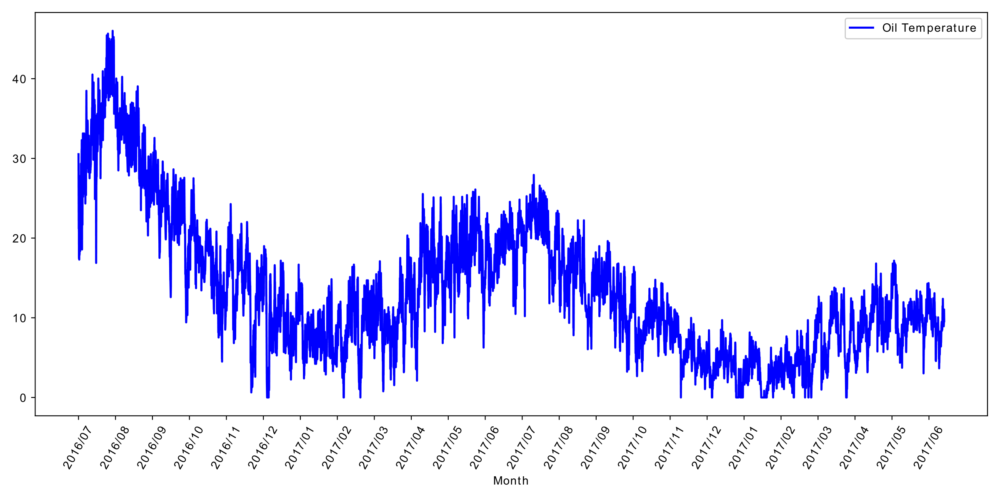
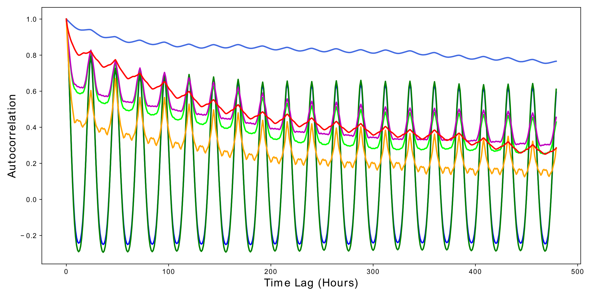

# Electricity Transformer Dataset (ETDataset) 

In this Github repo, we provide several datasets could be used for the long sequence time-series problem. All datasets have been preprocessed and they were stored as `.csv` files.  The dataset ranges from 2016/07 to 2018/07. [中文版本 | ChineseVersion](https://github.com/zhouhaoyi/ETDataset/blob/main/README_CN.md)

*Dataset list* (updating)

- [x] **ETT-small**: The data of 2 Electricity Transformers at 2 stations, including load, oil temperature.
- [ ] **ETT-large**: The data of 39 Electricity Transformers at 39 stations, including load, oil temperature.
- [ ] **ETT-full**: The data of 69 Transformer station at 39 stations, including load, oil temperature, location, climate, demand.

If you use this dataset please cite the work `Informer @ AAAI2021 Best Paper Award`[\[paper\]](https://arxiv.org/abs/2012.07436)[\[code\]](https://github.com/zhouhaoyi/Informer2020)[\[video\]](https://slideslive.com/38948878):

```
@inproceedings{haoyietal-informer-2021,
  author    = {Haoyi Zhou and
               Shanghang Zhang and
               Jieqi Peng and
               Shuai Zhang and
               Jianxin Li and
               Hui Xiong and
               Wancai Zhang},
  title     = {Informer: Beyond Efficient Transformer for Long Sequence Time-Series Forecasting},
  booktitle = {The Thirty-Fifth {AAAI} Conference on Artificial Intelligence, {AAAI} 2021, Virtual Conference},
  volume    = {35},
  number    = {12},
  pages     = {11106--11115},
  publisher = {{AAAI} Press},
  year      = {2021},
}
```

## Why *Oil Temperature* is involved in this dataset?

The electric power distribution problem is the distribution of electricity to different areas depends on its sequential usage. But predicting the following demand of a specific area is difficult, as it varies with weekdays, holidays, seasons, weather, temperatures, etc. However, no existing method can perform a long-term prediction based on super long-term real-world data with high precision. Any false prophecy may damage the electrical transformer. So currently, without an efficient method to predict future electric usage, managers have to make decisions based on the empirical number, which is much higher than the real-world demands. It causes unnecessary waste of electric and equipment depreciation. On the other hand, the oil temperatures can reflect the conditon of electricity Transformer. One of the most efficient strategies is to predict how the electrical transformers' oil temperature is safe and avoid unnecessary waste. 
As a result, to address this problem, our team and Beijing Guowang Fuda Science & Technology Development Company built a real-world platform and collected 2-year data. We work on it to predict the electrical transformers' oil temperature and investigate the extreme load capacity.

## ETT-small:

We donated two years of data, in which each data point is recorded every minute (marked by *m*), and they were from two regions of a province of China, named ETT-small-m1 and ETT-small-m2, respectively. Each dataset contains 2 year * 365 days * 24 hours * 4 times = 70,080 data point. Besides, we also provide the hourly-level variants for fast development (marked by *h*), i.e. ETT-small-h1 and ETT-small-h2. Each data point consists of 8 features, including the date of the point, the predictive value "oil temperature", and 6 different types of external power load features. 

<p align="center">


<br><br>
<b>Figure 1.</b>The overall view of "OT" in the ETT-small.&nbsp;&nbsp;&nbsp;&nbsp;<b>Figure 2.</b>The autocorrelation graph of all variables.
</p>

Specifically, the dataset combines short-term periodical patterns, long-term periodical patterns, long-term trends, and many irregular patterns. We firstly give an overall view in Figure 1, and it shows evident seasonal trends. To better examine the existence of long-term and short-term repetitive patterns, we plot the autorcorrelation graph for all the variables of the ETT-small-h1 dataset in Figure 2. The blue line in the above is the target 'oil temperature', and it maintains some short-term local continuity. However, the other variables (power load) shows short-term daily pattern (every 24 hours) and long-term week pattern (every 7 days).

We use the `.csv` file format to save the data, a demo of the ETT-small data is illustrated in Figure 3. The first line (8 columns) is the horizontal header and includes "date", "HUFL", "HULL", "MUFL", "MULL", "LUFL", "LULL" and "OT". The detailed meaning of each column name is shown in the Table 1.

<p align="center">

<br><br>
<b>Figure 3.</b> A demo of the ETT data.
</p>

| Field | date | HUFL | HULL | MUFL | MULL | LUFL | LULL | OT |
| :----: | :----: | :----: | :----: | :----: | :----: | :----: | :----: | :----: |
| Description | The recorded **date** |**H**igh **U**se**F**ul **L**oad | **H**igh **U**se**L**ess **L**oad | **M**iddle **U**se**F**ul **L**oad | **M**iddle **U**se**L**ess **L**oad | **L**ow **U**se**F**ul **L**oad | **L**ow **U**se**L**ess **L**oad | **O**il **T**emperature (target) |

<p align="center"><b>Table 1.</b> Description for each columm.</p>
